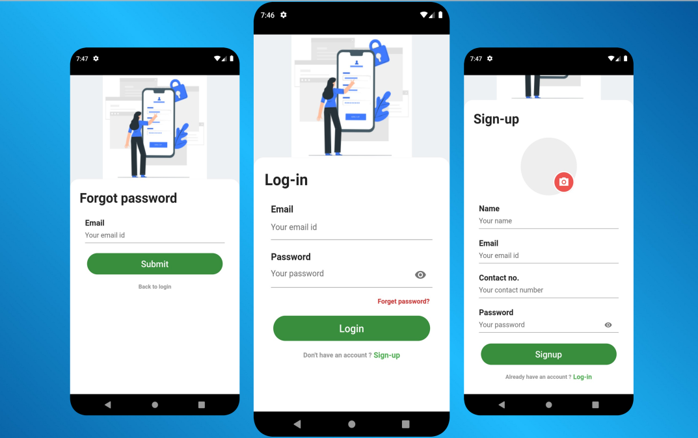

# Signin And Login Screens - Flutter UI

A new Flutter project.

## Getting Started

This project is a starting point for a Flutter application.

To clone this project, open your terminal or cmd

```
cd folder/to/clone-into/
```

```
git clone https://github.com/Salhianis1/flutter_signin_login.git
```

Then locate the project on your system and open with android studio or Vscode or intellij IDE.

To Run:
```
C:\path\to\project> flutter pub get

```
then run:

```
C:\path\to\project> flutter run

```
## Build release version

```
run: flutter build <OS PLATFORM> e.g flutter build ios
```

## Resources
A few resources to get you started if this is your first Flutter project:

- [Lab: Write your first Flutter app](https://docs.flutter.dev/get-started/codelab)
- [Cookbook: Useful Flutter samples](https://docs.flutter.dev/cookbook)

For help getting started with Flutter development, view the
[online documentation](https://docs.flutter.dev/), which offers tutorials,
samples, guidance on mobile development, and a full API reference.

## Prerequisites

What things you need to run the app

```
* Android Studio/Vscode/Intellij IDE
* Flutter SDK
* Android SDK
* Windows/MacBook/Linux
```
## Built With

- [Android Studio](https://developer.android.com/studio/install) - How to install Android Studio
- [Flutter](https://flutter.io) - Flutter Official website

## Author 😊

**Salhi Anis**

- [**Linkedin**](https://www.linkedin.com/in/anis-salhi-4ab324229/)


### Login Design 

